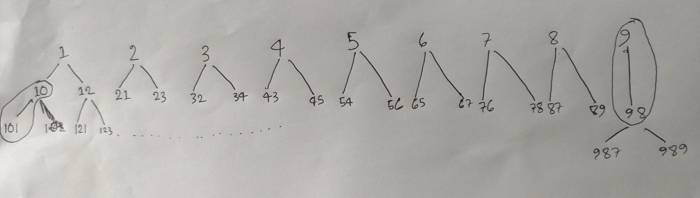

```
Input  :  low = 0, high = 21
Output :  [0,1,2,3,4,5,6,7,8,9,10,12,21]
```
```
From the picture you can see for each digit we've only 2 option except for the number which last digit is 0 or 9.
```
```CPP []
#include<bits/stdc++.h>
using namespace std;

void print(vector<vector<bool>> &matrix)
{
    for(auto &arr: matrix)
    {
        for(const auto &v: arr)
            cout << v << " ";
        cout << endl;
    }
    cout << endl;
}

class Solution
{
    public:
    vector<int> countSteppingNumbers(int low, int high)
    {
        queue<int> q;
        vector<int> ans;
        if(low == 0) ans.push_back(0);
        for(int i = 1; i < 10; i++){
            q.push(i);
            if(i >= low) ans.push_back(i);
        }

        int num, lastDigit, first, second;
        while(!q.empty())
        {
            num = q.front(); q.pop();
            lastDigit = num % 10;
            first  = (num * 10 + lastDigit - 1) * (lastDigit != 0);
            second = (num * 10 + lastDigit + 1) * (lastDigit != 9);
            if(first  > high) break;
            else if(first  != 0) ans.push_back(first), q.push(first);
            if(second > high) break;
            else if(second != 0) ans.push_back(second), q.push(second);
        }

        return ans;
    }
};

int main()
{
    Solution s;
    auto ans = s.countSteppingNumbers(0, 21);
    for(auto &v: ans) cout << v << " ";
}
```
```Python []
from collections import deque
from typing import List

class Solution:
    def countSteppingNumbers(self, low: int, high: int) -> List[List[int]]:
        ans, q = [], deque()
        if low == 0: ans.append(0)
        for i in range(1, 10):
            q.append(i)
            if i >= low: ans.append(i)
        
        while q:
            num = q.popleft()
            lastDigit = num % 10
            first  = (num * 10 + lastDigit - 1) * (lastDigit != 0)
            second = (num * 10 + lastDigit + 1) * (lastDigit != 9)
            if first  > high: break
            elif first  != 0: ans.append(first) ; q.append(first)
            if second > high: break
            elif second != 0: ans.append(second); q.append(second)
        return ans
    
def main():
    s = Solution()
    low, high = 7, 100
    ans = s.countSteppingNumbers(low, high)
    print(ans)

if __name__ == '__main__':
    main()
```