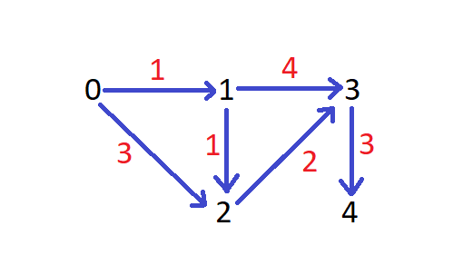
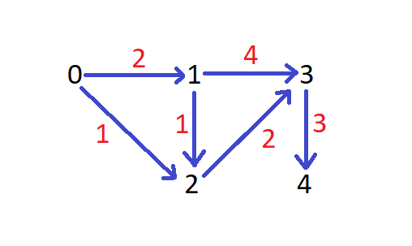

# Watch [first](https://youtu.be/Sj5Z-jaE2x0?si=FMzikifdQuBq_JO_), [second](https://youtu.be/t2d-XYuPfg0?si=rDbjtxva6UjXBRcG).

## Why we find the `Node with Minimum Cost at first`, then update it's adjacent node's cost?



- From 0 we can go to 1 and 2 with cost 1 and 3 respectively. The lowest cost is 1 (0 --> 1). So ofc we will start our next journey from the lowest cost because the current highest cost (3) path is 0 --> 2 and there maybe a path where the cost of going to 2 is less than 3 and that path actually exists here which is 0 --> 1 --> 2 and current total cost (1+1 = 2) is less than the old cost of 1 (3). 
- As our calculating Minimum Cost to reach all the nodes from the Source Node, we've to take the the node which has lower cost among node 1 and 2 to calculate the next node's minimum cost. Going from the heighest cost node doesn't make any sense.



- From 0 we can go to 1 and 2 with cost 2 and 1 respectively. Since cost[2] is lower, we will begin our next journey from the Node 2. If there was a path by taking which the cost[2] maybe more lower, then Djikstra algorithm will take that path, not the heighest path. So taking  the lowest cost path can guarantee us the optimal solution.

- cost[3] = 3 (0 --> 2 --> 3) representing From Source Node (here its 0) we can reach 3 with a Minimum Cost of 3. So cost[3] also reflecting all the past history that we once started our journey from the Source Node (0) and we reached Node 3 with different path but only 0 --> 2 --> 3 path gave us the minimum cost 3. So now when we calculate for the node 4 (from the node 3) like

## How min heap is working?


- Initially min heap has (0, sourceNode) as we will begin our journey from the Source Node which has 0 cost to reach from the Source Node itself.
- `Each value in min heap --> (currentCostOf_aNode, aNode)`

- Initially `cost = [0, $, $, $, $]`, `$ = float('inf')`

- After updating the cost of Adjacent Nodes (1,2) of the sourceNode (0), 

- - `cost = [0, 1, 3, $, $]`

- So Node 0 is processed/visited and Cost of Node 1 and 2 got updated. That means next we will pick the Node with Minimum Cost from the Node 1 and 2. We don't care Node 3 and 4 because their cost are float('inf') and we will never pick a Node with cost float('inf') lol and not also Node 0 as it's visited already.

- Now our min heap looks like :
```
                            (1,1)
                            (3,2)
```

- We pop up min heap and from Node 1 we update Node 2 and 3 and push (2,2) and (5,3) into heap.

- `cost = [0, 1, 2, 5, $]`

- min heap : 
```
                            (2,2)
                            (3,2)
                            (5,3)
```

- Now (2,2) will be popped up and from Node 2 we will update Node 3. `Node 2 is processed/visited`.
- Then next time (3,2) will be popped up but here in this step we can't update for the node 2 as `Node 2 is already visited.`
- So before updating check first if the Poped Up Node is already processed/visited or not.

## Which Node is the Destination Node ? 
- When we update the cost of Adjacent Nodes for the Poped Up Node, we are just updating the cost of adj nodes, can't guarantee that it will be minimum cost for that node. `But when we pop up a node i.e. (cost, node) from the min heap it is guaranteed that 'cost' for that 'node' will be MINIMUM 100%, is the reason why it get popped up from the heap because it's MINIMUM.`
- Most outer while loop will run maximum n node times. When we pop up min heap, we will do the comparison `maxCost = max(maxCost, cost[startNode])`, startNode = Poped Up Node. At the end if all nodes are visited then we will return `maxCost` which representing the minimum time to reach all the nodes from the source node.

```py
                    cost[3] + adjList[startNode = 3][adjNode = 4]
                              ___________________________________
                =      3    +                3
                                             |
                       |                      ----- This is the cost to reach Node 4 from the Node 3 (not from the sourceNode, be carefull!) 
                        --------------------------- And cost[3] means the Minimum Cost to reach Node 3 from the Source Node (0 here)
                =                 6
                                  |
                                   ---- Hence, this representing the minimum cost to reach Node 4 from the Source Node.
            
            If there is other paths to reach 4, then obviously later the minimum calculation will take place like min(cost[4], curCost)
```

## Here Graph is a n * n matrix which used Adjacency Matrix, Dense Graph.
```py
from heapq import heapify, heappush, heappop

class Solution:
    def djikstra(self, adjList: list[list[int]], n: int, sourceNode: int) -> int:
        visited, cost, parentOf = [False] * n, [float('inf')] * n, [-1] * n
        cost[sourceNode] = 0
        numberOfVisitedNodes, maxCost = 0, float('-inf')
        
        while True:
            startNode, prevMinCost = -1, float('inf')
            for node in range(n): # find the unvisited node with minimum cost
                if not visited[node] and cost[node] < prevMinCost:
                    prevMinCost = cost[node]
                    startNode = node
            
            if startNode == -1:  # means either every node visited or the graph is disconncted
                break
            
            for adjNode, weight in enumerate(adjList[startNode]): # update cost for all the connected node of startNode
                curCost = cost[startNode] + weight
                if weight != -1 and not visited[adjNode] and curCost < cost[adjNode]:
                    cost[adjNode] = curCost
                    parentOf[adjNode] = startNode
            
            visited[startNode] = True
            numberOfVisitedNodes += 1
            maxCost = max(maxCost, cost[startNode])
        
        if numberOfVisitedNodes == n: # print the final graph if we could reach to End from Source Node
            for to, fromm in enumerate(parentOf):
                print('From', fromm, 'To', to)
        print()
        return maxCost if numberOfVisitedNodes == n else -1
    
    # using min heap
    def djikstra1(self, adjList: list[list[int]], n: int, sourceNode: int) -> int:
        visited, cost, parentOf = [False] * n, [float('inf')] * n, [-1] * n
        cost[sourceNode] = 0
        pq = [(0, sourceNode)]
        heapify(pq)
        numberOfVisitedNodes, maxCost = 0, float('-inf')

        while len(pq) != 0:
            startNode = heappop(pq)[1]
            if visited[startNode] == True:
                continue

            for adjNode, weight in enumerate(adjList[startNode]):
                curCost = cost[startNode] + weight
                if weight != -1 and not visited[adjNode] and curCost < cost[adjNode]:
                    cost[adjNode] = curCost
                    parentOf[adjNode] = startNode
                    heappush(pq, (cost[adjNode], adjNode))
            
            visited[startNode] = True
            numberOfVisitedNodes += 1
            maxCost = max(maxCost, cost[startNode])
        
        if numberOfVisitedNodes == n: # print the final graph if we could reach to End from Source Node
            for to, fromm in enumerate(parentOf):
                print('From', fromm, 'To', to)
        print()
        return maxCost if numberOfVisitedNodes == n else -1

    def makeGraphFromInput(self, inputList, adjList: list[list[int]]) :
        for (fromm, to, cost) in inputList:
            adjList[fromm][to] = cost
    
    def minCost(self, inputList: list[list[int]], n: int, sourceNode: int):
        adjList = [[-1] * n for _ in range(n)]
        self.makeGraphFromInput(inputList, adjList)
        return self.djikstra1(adjList, n, sourceNode)


def main():
    si = Solution()
    inputList = [[0,1,1],[0,2,3],[1,2,1], [1,3,2],[2,3,2],[3,4,3]]
    print(si.minCost(inputList, 5, 0))
 
if __name__ == '__main__':
    main()
```

## Here Graph used Adjacency List which will work for 0 and 1 index efficiently without wasting a single memory.
```py
from collections import defaultdict
from heapq import heapify, heappush, heappop

class Solution:
    def djikstra(self, adjList: dict[list[int]], numberOfNodes: int, sourceNode: int) -> int:
        visited, cost, parentOf = defaultdict(lambda: False), defaultdict(lambda: float('inf')), defaultdict(lambda: -1)
        cost[sourceNode] = 0
        pq = [(0, sourceNode)]
        heapify(pq)
        numberOfVisitedNodes, maxCost = 0, float('-inf')

        while len(pq) != 0:
            startNode = heappop(pq)[1]
            if visited[startNode] == True:
                continue
            
            for (adjNode, weight) in adjList[startNode]: # updating the cost of the Nodes(adjNode) connected with the startNode
                curCost = cost[startNode] + weight
                if not visited[adjNode] and curCost < cost[adjNode]:
                    cost[adjNode] = curCost
                    parentOf[adjNode] = startNode
                    heappush(pq, (curCost, adjNode))
            
            visited[startNode] = True
            numberOfVisitedNodes += 1
            maxCost = max(maxCost, cost[startNode])
        
        if numberOfVisitedNodes == numberOfNodes: # print the final graph if we could reach to End from Source Node
            for to, fromm in parentOf.items():
                print('From', fromm, 'to', to)
        print()
        return maxCost if numberOfVisitedNodes == numberOfNodes else -1
        
    
    def createGraph(self, inputList: list[list[int]], adjList: dict[list[int]]) -> None:
        for (fromm, to, weight) in inputList:
            adjList[fromm].append((to, weight))
    
    def minCost(self, inputList: list[list[int]], n: int, k: int) -> int:
        adjList = defaultdict(list)
        self.createGraph(inputList, adjList)
        return self.djikstra(adjList, n, k)
    
def main():
    si = Solution()
    times = [[0,1,1],[0,2,3],[1,2,1], [1,3,2],[2,3,2],[3,4,3]]
    n, k = 5, 0
    print(si.minCost(times, n, k))

if __name__ == '__main__':
    main()
```

## Removing 'visited list/dictionary'

- min heap : 
```
                            (2,2)
                            (3,2)
                            (5,3)
```
- Here after (2,2) popped from the heap, the cost of Adjacent Nodes of Node 2 got updated.
- Next when (3,2) get popped we noticed Node 2 already processed and also the curCost 3 is > oldCost 2 of the Same Node 2.
- As we know when a Node get popped up from the Min Heap, it means that Node reached its SMALLEST cost and now we can use this Node's cost like (2,2). Node 2 has another variation in the min heap, (3,2), but doesn't matter how many variation we get of the Node 2, those variation will always have HIGHER COST like (3,2) has cost 3 which is > oldCost 2. 
- So instead of `if visited[startNode] == True` we can say `if curWeight > cost[startNode]`

```py
from typing import List
from collections import deque, defaultdict
from heapq import heapify, heappush, heappop

class Solution:
    def djikstra(self, adjList: dict[list[int]], numberOfNodes: int, sourceNode: int) -> int:
        cost, pq = defaultdict(lambda: float('inf')), [(0, sourceNode)]
        cost[sourceNode] = 0
        heapify(pq)
        numberOfVisitedNodes, maxCost = 0, float('-inf')

        while len(pq) != 0:
            curWeight, startNode = heappop(pq)
            if curWeight > cost[startNode]: # if curCost of the Node X is >= oldCost of the same Node X HAS THE SAME MEANING
                continue                    # if the Node X is already visited then continue
            
            for (adjNode, weight) in adjList[startNode]: # updating the cost of the Nodes(adjNode) connected with the startNode
                curCost = cost[startNode] + weight
                if curCost < cost[adjNode]: # if curCost < oldCost
                    cost[adjNode] = curCost
                    heappush(pq, (curCost, adjNode)) # pushing UPDATED nodes in the min heap
            
            numberOfVisitedNodes += 1
            maxCost = max(maxCost, cost[startNode])
        
        return maxCost if numberOfVisitedNodes == numberOfNodes else -1
    
    def createGraph(self, inputList: list[list[int]], adjList: dict[list[int]]) -> None:
        for (fromm, to, weight) in inputList:
            adjList[fromm].append((to, weight))
    
    def networkDelayTime(self, times: List[List[int]], n: int, k: int) -> int:
        adjList = defaultdict(list)
        self.createGraph(times, adjList)
        return self.djikstra(adjList, n, k)

def main():
    si = Solution()
    times = [[2,1,1],[2,3,1],[3,4,1]]
    n, k = 4, 2
    print(si.networkDelayTime(times, n, k))

if __name__ == '__main__':
    main()
```

```js
Time  Complexity : O(n^2)
Space Complexity : O(NE), N = Nodes, E = Edges.
```


